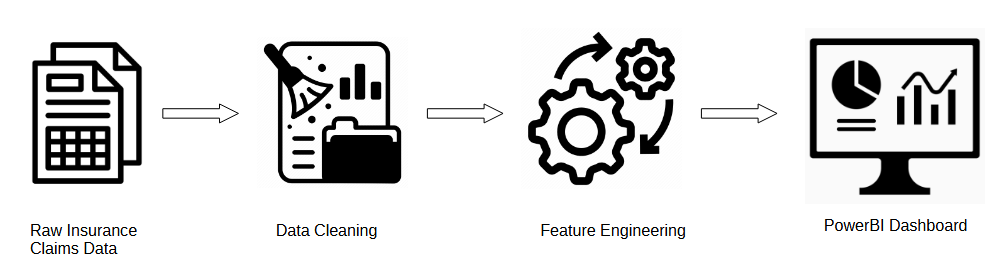

# Insurance Claims Analysis and Dashboard

## Project Overview

This project involves analyzing a raw insurance claims dataset, cleaning and preparing the data, performing feature engineering, and creating a comprehensive dashboard to understand the spread of reported fraudulent claims over various customer and claim attributes.

## Project Diagram

## Project Steps

### 1. Fetch Raw Insurance Claims Spreadsheet
The first step is to fetch the raw insurance claims spreadsheet from the following GitHub repository:
[Insurance Claims Dataset](https://github.com/Explore-AI/Public-Data/blob/master/insurance_claims_raw.xlsx).

### 2. Data Exploration and Cleaning
In this step, we explore and clean the dataset using Excel. The tasks include:
- **Descriptive Statistics:** Calculate key descriptive statistics to understand the data distribution.
- **Fixing Invalid Values:** Identify and fix invalid values by either dropping columns/rows or imputing the values.

### 3. Feature Engineering
Perform feature engineering on the cleaned dataset to create new features from existing ones. This step enhances the dataset's predictive power and provides more insights into the data.

### 4. Dashboard Creation in MS Power BI
Using the prepared dataset, create a dashboard in Microsoft Power BI. The dashboard focuses on understanding the spread of reported fraudulent claims over different customer/claim attributes. The visualizations include:
- Analysis of fraudulent claims by age category
- Fraud reported over contract years
- Binned values of total premiums paid
- Binned values of net value of the customer
- Binned values of net capital

## Dependencies
- Microsoft Excel
- Microsoft Power BI
