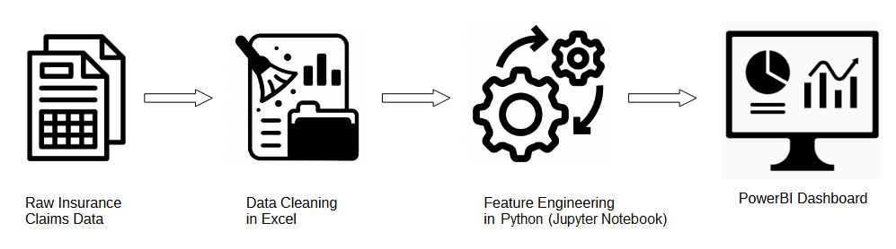

# Insurance Claims Analysis and Dashboard

## Project Overview

This project involves analyzing a raw insurance claims dataset, cleaning and preparing the data, performing feature engineering, and creating a comprehensive dashboard to understand the spread of reported fraudulent claims over various customer and claim attributes.

## Project Diagram

## Project Steps

### 1. Fetch Raw Insurance Claims Spreadsheet
The first step is to fetch the raw insurance claims spreadsheet from the following GitHub repository:
[Explore-AI/Public-Data](https://github.com/Explore-AI/Public-Data/blob/master).

### 2. Data Exploration and Cleaning
In this step, we explore and clean the [insurance claims dataset](https://github.com/kusasalethusithole1/integrated_project/blob/main/insurance_claims_raw.xlsx) using Excel. The tasks include:
- **Descriptive Statistics:** Calculate key descriptive statistics to understand the data distribution.
- **Fixing Invalid Values:** Identify and fix invalid values by either dropping columns/rows or imputing the values.

### 3. Feature Engineering
Using python within [a Jupyter Notebook](https://github.com/kusasalethusithole1/integrated_project/blob/main/Feature-Engineering-Workshop-3727.ipynb), we perform feature engineering on the cleaned dataset to create [new features](https://github.com/kusasalethusithole1/integrated_project/blob/main/Advanced%20Features%20Claims%20Data.csv) from existing ones. This step enhances the dataset's predictive power and provides more insights into the data.

### 4. Dashboard Creation in MS PowerBI
Using the prepared dataset, we create a [reporting dashboard](https://github.com/kusasalethusithole1/integrated_project/blob/main/insurance_fraud_analysis.pbix) in Microsoft PowerBI. The dashboard focuses on understanding the spread of reported fraudulent claims over different customer/claim attributes.

## Dependencies
-  Microsoft Excel
-  Jupyter Notebook
-  Microsoft PowerBI
